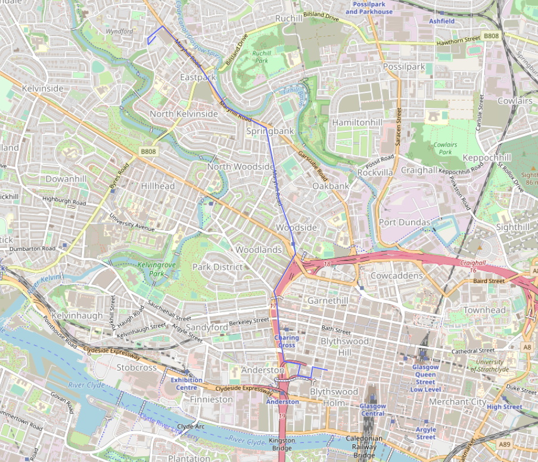

# co_jpm_car_hijack
Submission for JP Morgan's "I Reject Your Reality And Substitute My Own" Challenge at Code Olympics 2023

### Question – Company Car Hijack:


JP Morgan have recently had a company car stolen by a local thief. They appear to be knowledgeable of encryption techniques and have scrambled the GPS sensors’ output in attempts to cover their tracks.


The police have limited whereabouts of the thief’s location - they were last seen on CCTV wearing a number 47 football shirt whilst out walking their Rottweiler.


Your task is to decrypt the scrambled GPS transmissions in the log file and plot the car’s movement using a map tool of your choosing. This will aid the police in finding out where the car travelled and where it was abandoned.


<em>gps_transmissions.txt:</em>
```
dd]ge`dafef_bbfae[ \c]aebhedaf_hfcb_h
dd]ge`ffchbabfbgg[ \c]aee_aeecfegaheh
dd]ge_hbh_e_gb`fg[ \c]aeeaedegcga_d_f
dd]ge``a``adgcdag[ \c]aeg_cbabccfehcc
dd]ge`hfaecffdfff[ \c]aeff`a_de_abgcb
dd]geaa``e_`ddegg[ \c]aehh_`ggh_e_eec
dd]gecd_cbd_cdadb[ \c]af_dghb_`bhgg`a
dd]geehbchebcd_fac[ \c]af_hbfhhehef_dg
dd]gefdebhf_bhaag[ \c]af`aghe_aa_cdga
dd]gf_cch``aceccd[ \c]aegbdecg_eaeecb
dd]gfa_befd_fag_d[ \c]aegh_af_bgagdcd
dd]gfcf`g`bf`_eeg[ \c]af_eeafdebefgab
dd]gff`e`_`egbh`e[ \c]af`ahacb_bbedfd
dd]gg__ea`c`fg_c`[ \c]afabfa_chh_bbga
dd]gg`eb_`heddghe[ \c]affeg`hgfheg_`b
dd]ggch`_eaeebhcb[ \c]ag`dgbgeffdgec`
dd]ggfgdfefd`ehf_d[ \c]agec`gh__efdebc
dd]ggehb_`edb`hcf[ \c]aggcahb_dd`dfff
dd]ggec``_h_d__bg[ \c]aggbhghdhfgabc`
dd]ggf_f_dehe`_ca[ \c]agfbfcfh`afggf`e
```

### Solution:

Each full line is encoded using ROT47 - as hinted at in the question description. The competitor will need to decode each line using ROT47 decryption and plot the GPS points in any intuitive visual method. An example solution has been provided using Plotly’s Mapbox plugin for Python which enables plotting on a map as seen below.


*gps_transmissions_decoded.txt:*
```
55.86152767033726, -4.263965270974309
55.86177493237388, -4.266026647682969
55.86093906083178, -4.266265684820507
55.86112112584528, -4.268043234476944
55.86197264775777, -4.267712056023843
55.86221160155688, -4.269901889060664
55.86450435045253, -4.270589301398812
55.866934963450724, -4.270937996967058
55.86756397039228, -4.271289602204582
55.87044911246445, -4.268356480626643
55.87203675072805, -4.268902703828545
55.87471813710668, -4.270662756367823
55.87716101683916, -4.271292430336575
55.88006214178041, -4.272372049903382
55.88163019655896, -4.277681987968013
55.88491062663943, -4.281583867758641
55.887857675169705, -4.286418900675634
55.88693016531947, -4.288429305515777
55.88641109050038, -4.288398959782341
55.88707056961042, -4.2873747912788716
```

<strong>Example Map Visual:</strong>


<strong>Example Code For Map Visual:</strong>
```python
import plotly.express as px

def plot_gps(filename):
    gps_points = []

    with open(filename) as f:
        for line in f.readlines():
            elements = line.strip().split(", ")
            gps_lat = float(elements[0])
            gps_lon = float(elements[1])
            gps_points.append((gps_lat, gps_lon))

    map_plot = px.line_mapbox(lat=[point[0] for point in gps_points], lon=[point[1] for point in gps_points], hover_name=None, hover_data=None, zoom=13, height=800)
    map_plot.update_layout(mapbox_style="open-street-map")
    map_plot.update_layout(margin={"r":0,"t":0,"l":0,"b":0})
    map_plot.show()

plot_gps("gps_transmissions_decoded.txt")
```
